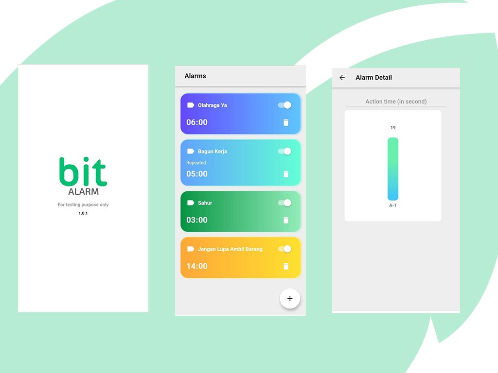

# BitAlarm

Simple Alarm Application (Android Only)

### Requirement
- Android JellyBean (4.2)
- Available Space 30MB

### Screen Shot

### Feature
- [:heavy_check_mark:] Create/Delete alarm
- [:heavy_check_mark:] Repeat alarm
- [:heavy_check_mark:] Action time report (Bar Chart Vertical)
- [:heavy_check_mark:] Ring Notification

## How To Use
1. Download APK [Here](bitalarm.apk)
2. Install on local device
3. Done

